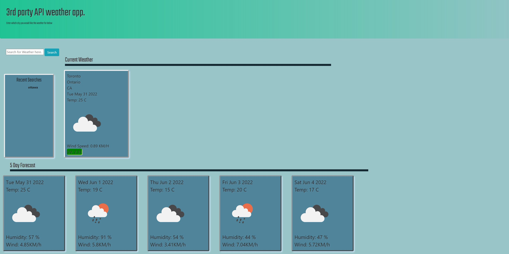

# 3rd party API weather app

## Description
The following project creates a basic weather search app using Jquery,bootstrap,moment, google fonts and openweather APIs. The current search will render in recent search history and allow you to click any item within that list to launch a new search. 

While in the beginning this project presented itself as straight forward and simple, I found it offered a few fun challenges to over come by forcing me to learn new ways to solve problems.

 

## Mock Up and screenshots

Below you will see a screen shot of the deployed web app.

## Technology

This project utilizes the following technologies:
moment
Jquery
bootstrap
google fonts
open weather API ( one call 1.0 and geo coding)

## Installation

  The website can be viewed through GitHub pages [here](https://ydennekrf.github.io/Mighty-Zoo/)